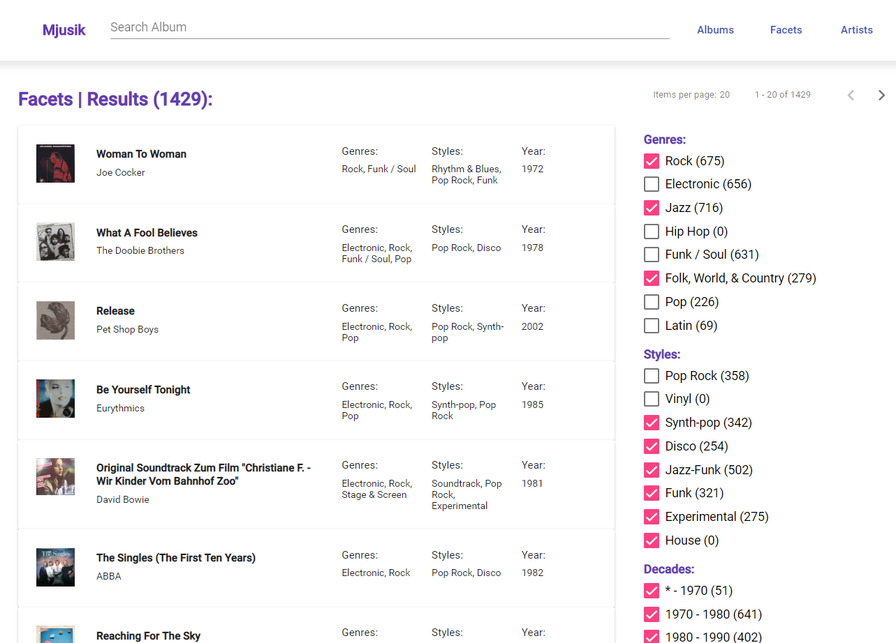
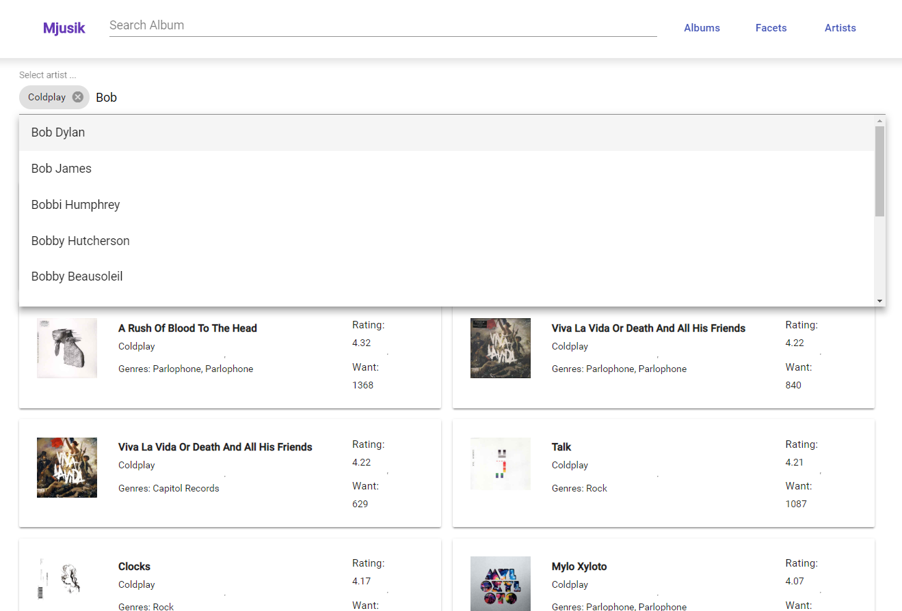

# Vyhľadávanie informácií (Information Retrieval)

## Zadanie I.
 
 **Richard Mocák**
 
 **xmocak**
 
 *(21. OKT. 2018)*

## Dokumentácia

### Doména zadania
Zo začiatkov som rozmýšľal dolovať informácie o hudobných koncertoch, čo sa po úvodných konzultáciach zmenilo na vyhľadávanie informácii o hudobných skupinách, konkrétne informácie o hudbníkoch a ich diskografia. 

Pre vyhľadávanie som sa zameral na 3 stránky, na ktorých sa nachádzali dobre členené informácie o albumoch, poskytovali pokročilejšie rozhranie pre hlbšie prehľadávanie dát a nachádzali sa tam aj informácie o autoroch. Nakoniec som tieto informácie získal zo stránky [discogs.com](www.discogs.com), ktorá poskytovala najlepšie členené dáta a umožňovala pokročilé prehľávanie albumov podľa potrebných atribútov (žáner, štýl, rok, ...).

### 1. Dolovanie a čistenie dát

#### Dolovanie dát
V prvom kroku som implementoval webový prehľadávač (z angl. web crawler) prostredníctvom knižníc *Selenium* (simulačný webový prehliadač - Google Chrome) a *BeautifulSoup* (parsovanie HTML obsahu a výber informácií) v programovacom jazyku *Python*.

Script k dolovaniu dát sa nachádza v priečinku *web-crawler* a súbore **web-crawler.py**. 

Dolovanie dát prebihealo prehľadávaním do hĺbky. Prehľadávač som spustil na [stránke prehľadávania albumov](https://www.discogs.com/search/?sort=want%2Cdesc&style_exact=Pop+Rock), kde sú albumy zoradené podľa žiadanosti (atribút Most Wanted) a je ich možné filtrovať podľa žánru. Prehľadávač postupne navštevoval stránku albumu, následne stránku autora ak už danú stránku autora neprehľadával skôr. Po prehľadaní všetkých albumov a autorov, prehľadávač prešiel na ďalšiu stránku a pokračoval v dolovaní údajov. Keďže dolovanie prebiehalo prostredníctvom simulačného webového prehľadávača, dolovanie bolo dosť pomalé a vykonávalo sa iba na jednom vlákne a nie paralelne.

```python
# Page Level
for page in range(batch_size):

    # Get album ids ...
    albums_ids = []

    # Album LEVEL
    for element_id in albums_ids:
        
         album.click()
         # Parse album data
         window.location.goBack()
         
         artist.click()
         # Parse artist data
         artist.location.goBack()
    
    # Go to next page
    next_page_button.click()
           
```

#### Ukážka dát
Pre každý žáner som spúšťal prehľadávač samostatne, keďže dáta na stránke neboli vždy konzistentne štruktúrované a program bol často nežiaduce zastavený pre chybu. Dáta som ukladal do JSON súborov a ukážka jedneho záznamu albumu vyzerá takto:

```
// ALBUM
{
    "name": "Jagged Little Pill",
    "author": "/artist/102789-Alanis-Morissette",
    "genres": ["Rock", "Pop"],
    "styles": ["Alternative Rock", "Acoustic", "Pop Rock"],
    "year": "1995",
    "image_url": "https://img.discogs.com/hajkhakjjkha.jpg",
    "stats_have": "15629",
    "stats_want": "4503",
    "stats_rating": "4.18",
    "stats_ratings_count": "1785",
    "songs": [
      {
        "title": "All I Really Want",
        "time": "4:45"
      },
       ...
    ],
    "comments": [
      {
        "name": "Dexter_prog",
        "date": "August 9, 2018",
        "text": "Great pressing with pristine sound ... Long text"
      },
      ...
    ]
  }


// ARTIST
{
    "name": "Coldplay",
    "realName": "Alanis Nadine Morissette",
    "profile": "Canadian singer born on June 1, 1974 in Ottawa, Ontario, ... Long text",
    "sites": ["alanis.com", "MySpace", "YouTube", "Twitter", "Facebook", "Wikipedia"],
    "members": ["Cherie Currie", "Jackie Fox", "Joan Jett"],
}
```

#### Čistenie dát
Keďže dolované dáta sa nachádzali osobitne pre každý źáner a tiež oddelene údaje o albumoch a oddelene o umelcoch, potreboval som dáta zjednotiť, vyčistiť od nadbytočných bielych znakov, previesť na správny formát (najmä čísla), pridať dátum úpravy a pripraviť na import do elasticsearch (prostr. rozhrania bulk).

Script čistenia dát sa nachádza v priečinku *web-crawler* a názov súboru je **clean-data.py**.


### 2. Vytvorenie indexov a mapovanie v Elasticsearch
Elasticsearch a nástroj Kibana ( obe verzie 6.4.2) som spustil lokálne prostredníctvom platformy **docker**. Elasticsearch bežal na adrese *localhost:9200*.

#### Vytvorenie indexu, mapovanie, analyzátory
Vytvoril som index **albums**, ktorý obsahoval dokumenty typu **album**.

Pri vytváraní indexu som vyvtoril 2 vlastné analyzátory, ktoré pozostávali kombinácie existujucích tokenizátorov a filtrov.

1. **full_text_analyzer** - Tento analyzátor najmä využivám ako analyzátor pri vyhľadávani a nie pri procese indexovania. yužíva kombináciu štandardného fitra, prevodu na malé písmená a prevodu znakov do ASCII ekvivalentu.

2. **partial_text_analyzer**  - Tento analyzátor využívam najmä pri procese indexovanie, keďže okrem rovnakých procesov ako predchádzajúci analyzátor vytvára indexy aj z prefixov ('hell' => 'h', 'he','hel', 'hell'), čo umožňuje rýchlejšie vyhľadávanie prefixov, ktoré využijem pri vyhľadávaní dokumentov pri komplexnejších scenároch.
 
```
 {
     "settings": {
        "number_of_shards": 1,
        "number_of_replicas": 0,
        "analysis": {
          "analyzer": {
              "full_text_analyzer": {
                  "type": "custom",
                  "tokenizer": "standard",
                  "filter": ["standard", "lowercase", "asciifolding"]
              },
              "partial_text_analyzer" : {
                  "type" : "custom",
                  "tokenizer" : "standard",
                  "filter" : ["standard", "lowercase", "asciifolding", "my_edge_ngram"]
                  }
            },
            "filter" :{
                "my_edge_ngram" : {
                    "type" : "edgeNGram",
                    "min_gram" : 1,
                    "max_gram" : 15,
                    "side" : "front"
                }
            }
        }
      }, 
  }
```

Mapovanie údajov z ukážky dát na dokument typu **album** mapuje atrubúty rôznych typov. Atribúty ako *name*, *songs.title*, *comments.name*, *comments.text* mapujem na typ **text**, aby som využil analyzátory pre process indexovania a vyhšadávania ako som opísal vyššie. Atribúty ako *genres*, *styles* mapujem na typ **keyword** aby som mohol v scenároch využívať možnosť agregácie albumov do vedier práve podľa týchto kľúčových slov. 

Zaujímavý je atribút **artist_name**, ktorý je namapovaný ako kombinácia typov *text* pre využitie vlastných analyzátorov ale aj mapovanie na **atrist_name.keyword** typu *keyword* pre agregovanie.

V mapovaní sa ešte nachádzajú atribúty numerického typu (*stats_have*, *stats_rating*, ...) a atribúty typu *date* (*created*, *songs.time*, *comments.date*).

```
{
  "mappings": {
    "album": {
      "properties": {
        "name":    { 
          "type": "text",
          "analyzer": "partial_text_analyzer", 
          "search_analyzer": "full_text_analyzer"
        },
        "author":     { "type": "keyword"  },
        "genres":{"type": "keyword"},
        "styles":{"type": "keyword"},
        "year":      {
          "type": "integer"
        },
        "imageUrl": {"type" : "keyword"},
        "stats_have": {"type": "integer"},
        "stats_want": {"type" : "integer"},
        "stats_rating": {"type" : "double"},
        "stats_ratings_count": {"type" : "integer"},
        "songs": {
          "type": "nested",
          "properties": {
            "title": {
              "type": "text",
              "analyzer": "partial_text_analyzer", 
              "search_analyzer": "full_text_analyzer"
            },
            "time": {
              "type" : "date",
              "format": "m:ss||(m:ss)"
            }
          }
        },
        "comments": {
          "type": "nested",
          "properties": {
            "name": {
              "type": "text",
              "analyzer": "partial_text_analyzer", 
              "search_analyzer": "full_text_analyzer"
            },
            "date": {
              "type": "date",
              "format": "MMMM d, yyyy"
            },
            "text": {
              "type": "text",
              "analyzer": "partial_text_analyzer", 
              "search_analyzer": "full_text_analyzer"
            }
          }
        },
        "created": {
          "type": "date",
          "format": "yyyy-MM-dd"
        },
        "artist_name": {
          "type": "text",
          "fields": {
             "keyword": {
                "type": "keyword",
                "ignore_above": 256
             }
                  },
          "analyzer": "partial_text_analyzer", 
          "search_analyzer": "full_text_analyzer"
        },
        "artist_key": {"type": "keyword"},
        "artist_real_name": {
          "type": "text",
          "analyzer": "partial_text_analyzer", 
          "search_analyzer": "full_text_analyzer"
        },
        "artist_profile": {
          "type": "text",
          "analyzer": "partial_text_analyzer", 
          "search_analyzer": "full_text_analyzer"
        },
        "artist_sites": {"type": "keyword"},
        "artist_members": {
          "type": "text",
          "analyzer": "partial_text_analyzer", 
          "search_analyzer": "full_text_analyzer"
        }
      }
    }
  }
```

#### Import dát - bulk rozhranie

Pre import dát do Elasticsearch som využil bulk rozhranie, ktorým som odoslal finálny JSON súbor **albums-02.json**, ktorý sa nachádza v priečinku *web-crawler/EXPORT*. 

### 3. Scenáre použitia a webová aplikácia (Angular)

Rozhodol som sa pre možnosť implementovať 3 netriviálne scenáre vyhľadávanie dokumentov prostredníctvom Elasticsearch v aplikácii s použivateľským rozhraním pre modifikáciu týchto scenárov. Na základe mojich zručností a skúseností som sa rozhodol pre webovú aoplikáciu a aplikačný rámes **Angular 6**. Použivateľské prostredie som vytvoril aj s použitím knižnice **@angular/material**, ktorá poskytuje už hotové komponenty. Pre komunikáciu s elasticsearch som využil oficiálnu Javascriptovú knižnicu **elasticsearch.js**. Zdrojové súbory sa nachádzajú v priečinku *web-app*.

Teraz sa budem trochu detailnejie venovať každému z 3 scenárov.

#### Vyhľadávanie albumov podľa mena albumu, mena autora a názvy piesne


*Component SRC: src/app/pages/album-search*

Používateľ vie vyhľadávať albumy podľa albumu, umelca alebo titulu pesničky z albumu. Ak používateľ nezadá žiadne vstupný text, vyhľadávajú sa všetky albumy. Vyhľadávanie je stránkované po 20 albumoch na stránku. Vy výsledkoch sa nájdene slová farebne vyznačujú (z angl. highlighting). Vo výsledkoch sa zobrazuje obrázok, názov, autor, pesničky, žánre a štýly albumu.

HTTP request takéhoto scenáru vyzerá následovne
```http request
POST http://localhost:9200/albums/album/_search
{
  "from": 0,
  "size": 20,
  "query": {
    "multi_match": {
      "query": "mylo",
      "fields": [
        "name^6",
        "artist_name^3",
        "song.title"
      ]
    }
  },
  "highlight": {
    "fields": {
      "name": {},
      "artist_name": {},
      "songs.title": {}
    }
  }
}

```

Parametre *from* a *size* sa využívajú na stránkovanie.
*query* je typu *multi_match*, ktorý prehľadáva viacero atribútov dokumentu a skóre môže byť následne posilnené podľa atribútu (**boosted**) ako na príklade kde je výskyt v atribúte *name* 6-násobne relevantnejší ako výskyt v atribúte *song.title*. Keďže sme implementovali analyzátor **partial_text_analyzer**, vráti toto vyhľdvanie aj výskyt v prefixoch slov daných atribútov.

V závere určím, v ktorých atribútoch chcem farebne vyznačovať výskyty prostredníctvom parametra **highlighting**.


#### Vyhadávanie a filtrovanie albumov podľa agregácií a názvu albumu




*Component SRC: src/app/pages/facets*

V druhom scenry umožňuje prostredníctvom vstupného okna vyhľadávať albumy podľa názvu albumu. Použivateľ môže filtrovať albumy podľa žánru, štýlova a príslušnej dekády prostredníctvom kategorizovaného formuláru. Ak použivateľ nezadal vstup, filtrujú sa všetky dokumenty podľa filtorv z kategorizovaného formuláru. Vyhľadávanie je tiež stránkované.

V tomto scenári sa na elasticsearch dopytojem dvoma HTTP requestami.

1. *Inicializácia agregácií* - prostredíctvom agregácie typu **significant_terms** získam 8 najzaujímavejších hodnôt vyskytujúcich sa v dokumentoch. Túto agregáciu využijem pre atribúty **genres** a **styles**. Formulár dekád, získam prostredníctvom agregácie **range** na atribúte **year**.
```http request
POST http://localhost:9200/albums/album/_search
{
  "aggregations": {
    "genres_terms": {
      "significant_terms": {
        "field": "genres",
        "size": 8
      }
    },
    "styles_terms": {
      "significant_terms": {
        "field": "styles",
        "size": 8
      }
    },
    "decade_ranges": {
      "range": {
        "field": "year",
        "ranges": [
          { "to": 1970 },
          { "from": 1970, "to": 1980 },
          { "from": 1980, "to": 1990 },
          { "from": 1990, "to": 2000 },
          { "from": 2000, "to": 2010 },
          { "from": 2010 }
        ]
      } 
    }
  }
}
```

2. *Vyhľadávanie a filtrovanie albumov* - V tomto requeste sa tiež využívajú parametre *from* a *size* na stránkovanie výsledkov. **query** je typu **bool**, ktorý vyhľadáva indexy atribútu name (podobne ako minule, záhrňa to aj prefixy). Výsledky sú následne filtrované podľa zaškrtnutých prvkov agregácií žanrov, štýlov a dekády. Využité sú na to filtre **terms** a **range**. V tele requestu sa nachádzajú agregácie ako pri incilaizácií aby sme vedeli aktualizovať počet dokumentov na agregáciu v použivateľskom rozhraní.

```http request
POST http://localhost:9200/albums/album/_search
{
  "from": 0,
  "size": 20,
  "query": {
    "bool": {
      "must": [{"match": { "name": "aa"}}],
      "filter": [
        { "terms": { "genres": ["Rock", "Hip Hop"] }},
        { "terms": { "styles": ["Pop Rock", "Jazz-Funk"] }},
        {
          "bool": {
            "should": [
              { "range": { "year": { "gte": 1990, "lte": 2000 }}},
              { "range": { "year": { "gte": 2010 }}}
            ]
          }
        }
      ]
    }
  },
  "aggregations": {
    // ... SAME AS INITIALIZATION (STEP 1.)
  }
```

#### Vyhľadávanie, filtrovanie a triedenie albumov podľa autora





*Component SRC: src/app/pages/artist-search*

V tomto scenári môže použivateľ vyhľadávať albumi podľa názvu albumu, ktorý zadá do vstupného okna. Môže filtrovať albumy podľa autora, ktorého si vyberie zo Autocomplete Select Boxu, ktorý filtruje mená autorov podľa zadaného vstupu. Použivateľ môže stránkovať výsledky. Pužívateľ môže prepínať medzi usporiadaním výsledkov podľa **relevantnosti vyhľadávania** (**_score**) alebo podľa hodnotenia a žiadanosti albumu zostupne (atribúty *stats%rating*, *stats_want*).

V tomto scenári sa na elasticsearch zasielali 2 typy requestov:

1. *Autocomplete autorov* - Tento request vyhľadával také dokumenty, kde atribút **artist_name** (full text) prefix slov obsahoval hľadaný výraz. Zároveň ale odfiltroval preč všetky dokumenty, ktorých atribút **artist_name.keyword** (keyword) neobsahuje už autora, ktorý bol vybratý v autocomplete. Zároveň definujeme aby nevracal žiaden výsledky (**size** je rovné nula), ale iba **agregácie** 10 autorov (atribút *artist_name.keyword*) s najväčším počtom vyhľadaných dokumentov. Z týchto agregácií sa vytvorí zoznam možností v autocomplete select boxe.

```http request
POST http://localhost:9200/albums/album/_search
{
  "size": 0,
  "query": {
    "bool": {
      "must": [{ "match": { "artist_name": "Bob" }}],
      "filter": {
        "bool": {
          "must_not": { "terms": { "artist_name.keyword": [ "Coldplay" ] }}
        }
      }
    }
  },
  "aggregations": {
    "artists": {
      "terms": { "field": "artist_name.keyword", "size": 10 }
    }
  }
}
```
2. *Filtrovanie, vyhľadávanie a zoradenie albumov* - V tomto requeste prebieha rovnko ako pri predchadzajúcich scenároch stránkovanie prostredníctvom atribútov *from* a *size*. Ak používateľ zvoli možnosť **zoradiť** podľa hodnotenia a žiadanosti, tak sa pridá parameter *sort* pre atribúty *stats_rating* a *stast_want* zoradené zostupne. V *query* sa vyhľadávajú albumy, ktorých atribút *name* obsahuje hľadaný výraz (zase aj prefixy, ako pri predch. scenároch). Výsledky sa filtrujú podľa zvolených autorov zo autocomplete vďaka atribútu *artist_name.keyword*. Ak použivateľ nevybral, žiadneho autora, parameter filter, sa v requeste nenachádza.

```http request
POST http://localhost:9200/albums/album/_search
{
  "from": 0,
  "size": 20,
  "sort": [
    { "stats_rating": { "order": "desc" }},
    { "stats_wants": { "order": "desc"}}
  ],
  "query": {
    "bool": {"must": [{ "match": { "name": "The" }}],
      "filter": {
        "bool": {
          "must": { "terms": { "artist_name.keyword": [ "Coldplay", "Bob Dylan"]}          }
        }
      }
    }
  }
}

```

### Zhodnotenie

Tento projekt bol pre mňa veľmi prínosný. Príprava crawlera a dolovanie dát ma veľmi zaujali a určite som rad, že som v tejto oblasti nabral nove znalosti. Njaviac ma oslovila práca s Elasticsearch a najmä rýchla odozva vyhľadávania. Okrem toho ma silno zaujala jednoduchosť písania HTTP requestov do elasticu a možnosti indexovania atribútov pre využitie v rôznych scenároch. Verím a dúfam, že ešte budem niekedy v budúcnosti môcť pracovať s elasticearchom. Snažil som sa do tohto projektu skutočne vložiť a spraviť to najlepšie ako viem. Pomohli mi aj konzultácie, keď som niekedy uviazol na mrtvom bode a nevedel sa posunúť ďalej, alebo som niečo robil zle.
